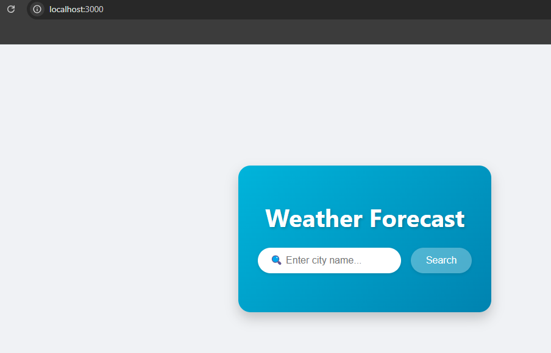
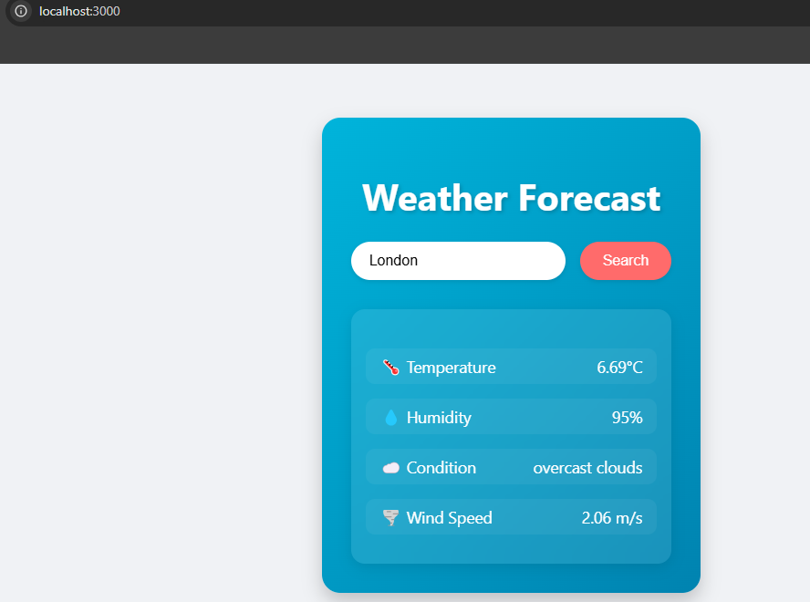
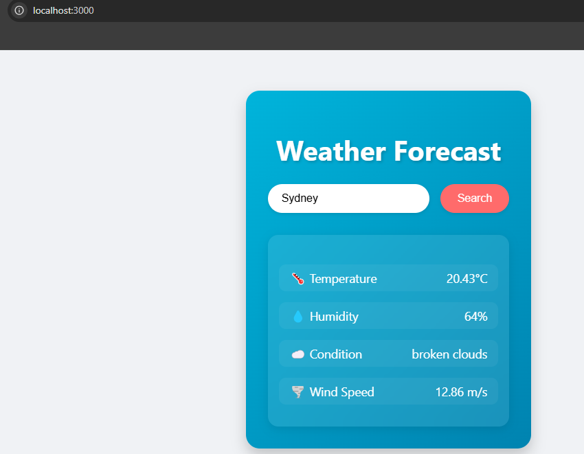
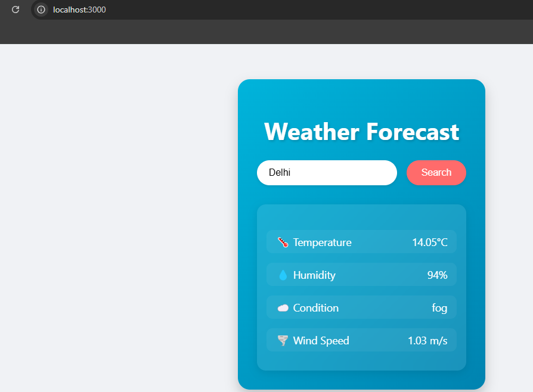

# Weather Forecast Application

A modern, responsive weather application built with Spring Boot and React that provides real-time weather information using the OpenWeatherMap API.



## Features

- ✨ Real-time weather data retrieval
- 🎨 Clean and modern UI with gradient design
- 📱 Responsive layout for all devices
- ⚡ Redis caching for improved performance
- 🌍 City-based weather search
- 🌡️ Displays temperature, humidity, wind speed, and weather conditions
- ⌨️ Keyboard support (Enter key) for quick searches
- 🚨 Error handling with visual feedback

## Tech Stack

### Backend
- Java 17
- Spring Boot 3.2.3
- Spring Cache with Redis
- OpenWeatherMap API
- Maven

### Frontend
- React 18
- Axios for API calls
- Modern CSS with transitions and animations
- Responsive design

## Setup Instructions

### Prerequisites
- Java 17 or higher
- Node.js and npm
- Redis server
- OpenWeatherMap API key

### Backend Setup

1. Clone the repository:
   ```shell
   git clone https://github.com/bondsaurabh/weather-forecast.git
   cd weather-forecast
   ```

2. Configure OpenWeatherMap API key in `application.properties`:
   ```properties
   openweathermap.api.key=your_api_key_here
   openweathermap.api.url=https://api.openweathermap.org/data/2.5
   spring.cache.type=redis
   spring.redis.host=localhost
   spring.redis.port=6379
   spring.cache.redis.time-to-live=1h
   ```

3. Start Redis server:
   ```shell
   # Windows
   redis-server

   # Linux/Mac
   sudo service redis start
   ```

4. Run the Spring Boot application:
   ```shell
   ./mvnw spring-boot:run
   ```

### Frontend Setup

1. Navigate to frontend directory:
   ```shell
   cd frontend
   ```

2. Install dependencies:
   ```shell
   npm install
   ```

3. Start the React application:
   ```shell
   npm start
   ```

The application will be available at `http://localhost:3000`

## API Endpoints

### Get Weather Data
GET `/api/weather/{city}`

#### Success Response
```json
{
  "description": "scattered clouds",
  "temperature": 8.33,
  "windSpeed": 2.57,
  "humidity": 85,
  "name": "Houston",
  "main": {
    "temp": 8.33,
    "feels_like": 6.79,
    "temp_min": 7.23,
    "temp_max": 10.01,
    "pressure": 1029,
    "humidity": 85,
    "sea_level": 1029,
    "grnd_level": 1027
  },
  "weather": [
    {
      "description": "scattered clouds"
    }
  ],
  "wind": {
    "speed": 2.57,
    "deg": 10
  }
}
```

#### Error Response
```json
{
  "message": "City not found. Please check the city name."
}
```

## Sample Weather Data

### London, UK

```yaml
Temperature: 6.69°C
Humidity: 95%
Condition: overcast clouds
Wind Speed: 2.06 m/s
```

### Sydney, Australia

```yaml
Temperature: 20.43°C
Humidity: 64%
Condition: broken clouds
Wind Speed: 12.86 m/s
```

### Delhi, India

```yaml
Temperature: 14.05°C
Humidity: 94%
Condition: fog
Wind Speed: 1.03 m/s
```

## Testing

Run the test suite:
```shell
./mvnw test
```

## Caching

The application uses Redis for caching weather data with a TTL of 1 hour. This helps in:
- Reducing API calls to OpenWeatherMap
- Improving response times
- Handling rate limits

## Error Handling

The application includes comprehensive error handling for:
- Invalid city names
- API connection issues
- Server errors
- Rate limiting

Error messages are displayed in a user-friendly format with visual indicators.

## Contributing

1. Fork the repository
2. Create your feature branch:
   ```shell
   git checkout -b feature/AmazingFeature
   ```
3. Commit your changes:
   ```shell
   git commit -m 'Add some AmazingFeature'
   ```
4. Push to the branch:
   ```shell
   git push origin feature/AmazingFeature
   ```
5. Open a Pull Request

## License

This project is licensed under the MIT License - see the [LICENSE.md](LICENSE.md) file for details

## Acknowledgments

- OpenWeatherMap API for weather data
- Spring Boot team for the amazing framework
- React team for the frontend framework 